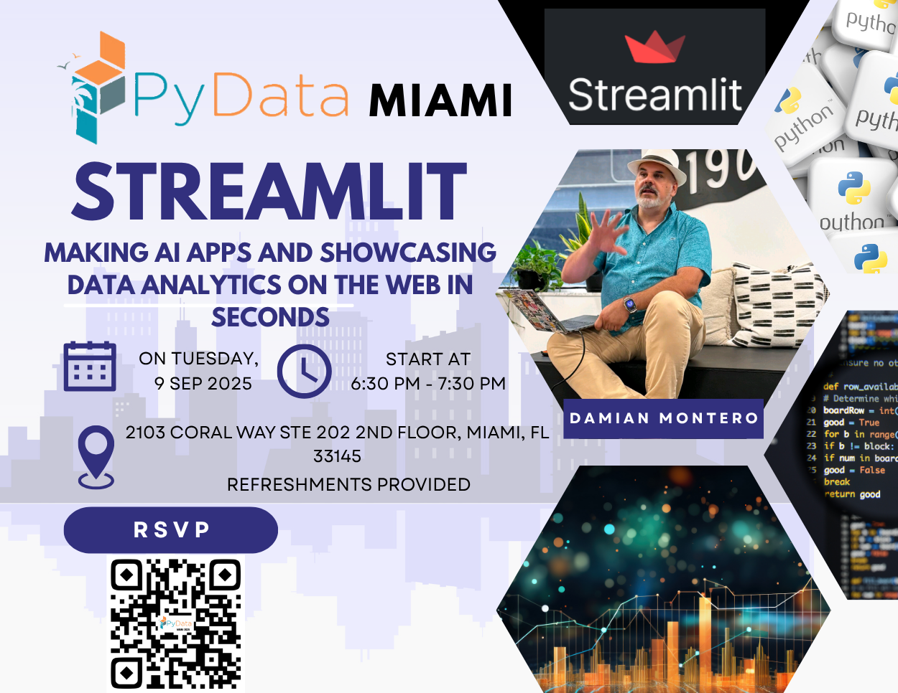

# This are the slides and apps used in the Sept 2025 presentation for PyData Miami

## Presentation
[Presentation Slides](https://docs.google.com/presentation/d/1EbxWSGVP_Gb1wyJL3g3FhtNBxOfdTJ4_jvUEcEmxB-s/edit?usp=sharing)

## Steps to recreate demo
1) Run installuv.sh (or just install UV) - Optional
2) Install all dependancies (pip install -r requirements or uv install)
3) rename the .streamlit/secrets-example.toml to just "secrets.toml" in the same directory
4) Run each Demo!

## Demos
- 01 - Basic StreamLit Example
- 02 - Basic API Call and showcase
- 03 - Basic FULL LLM example (Who needs ChatGPT)
- 04 - abTest Example  (you thought I wasn't a Data Analyst)

## Links 
- [StreamLit Cheat sheet](https://cheat-sheet.streamlit.app/) 
- [StreamLit Generative AI](https://streamlit.io/generative-ai)
- [StreamLit LLM full Examples](https://llm-examples.streamlit.app/)
- [Steamlit gallery](https://streamlit.io/gallery)
- [My RAG LLM Esxamples](https://github.com/thedamian/RAG-to-Riches)
- [Uber Pickups in NYC Demo](https://github.com/streamlit/demo-uber-nyc-pickups)
- [stackoverflow developer survey 2025](https://survey.stackoverflow.co/)
- [Great video on the panda's basic](https://www.youtube.com/watch?v=yg0Y7w4AHhw)
